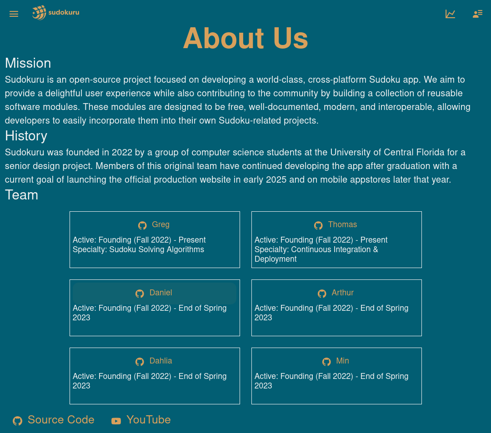
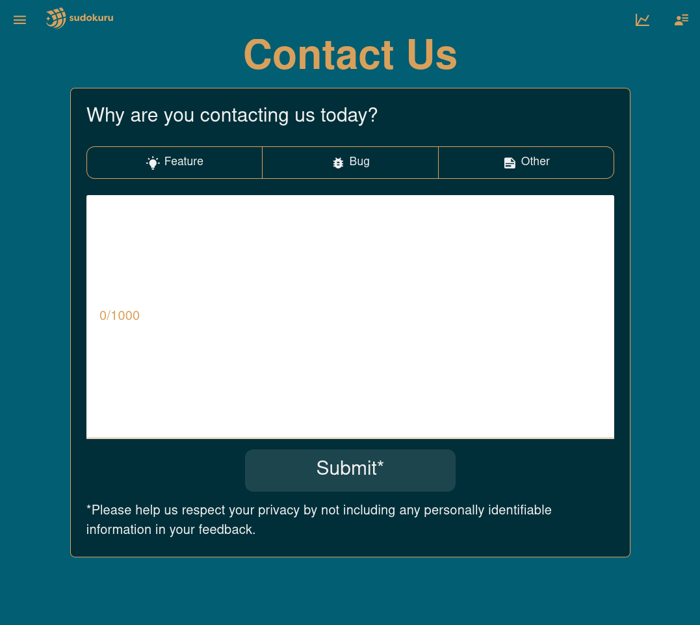
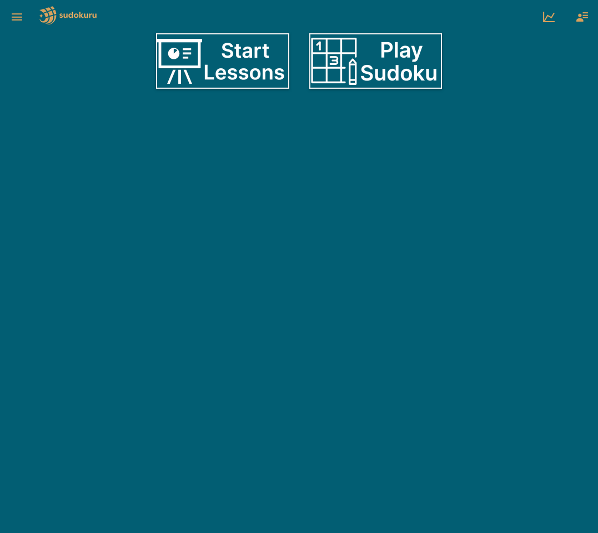
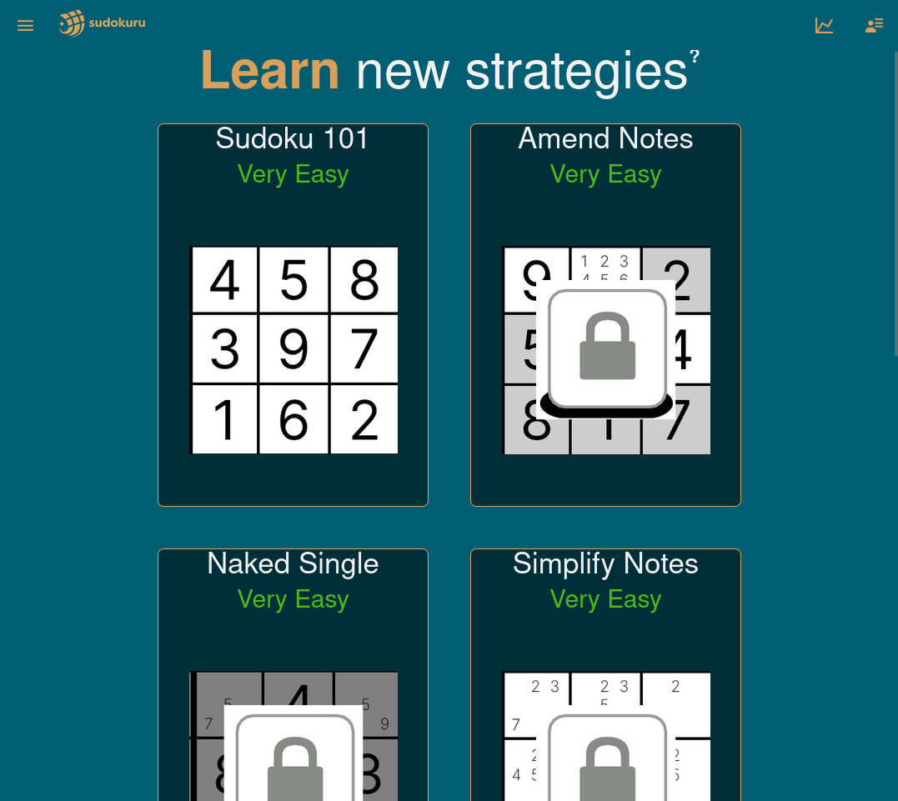
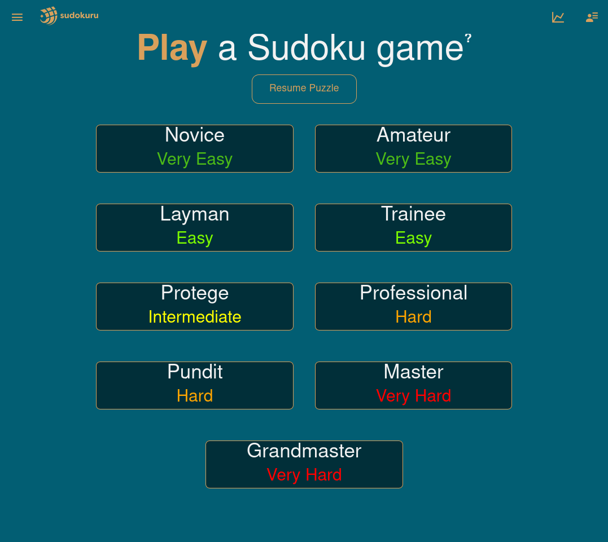
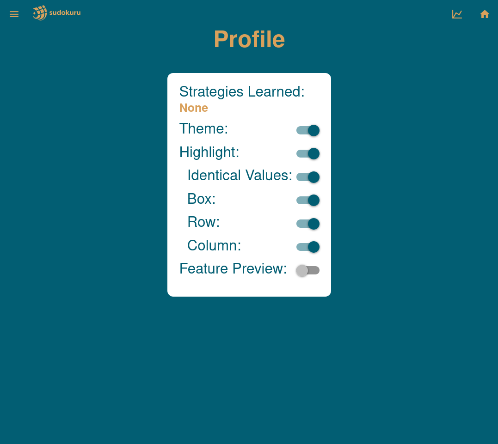
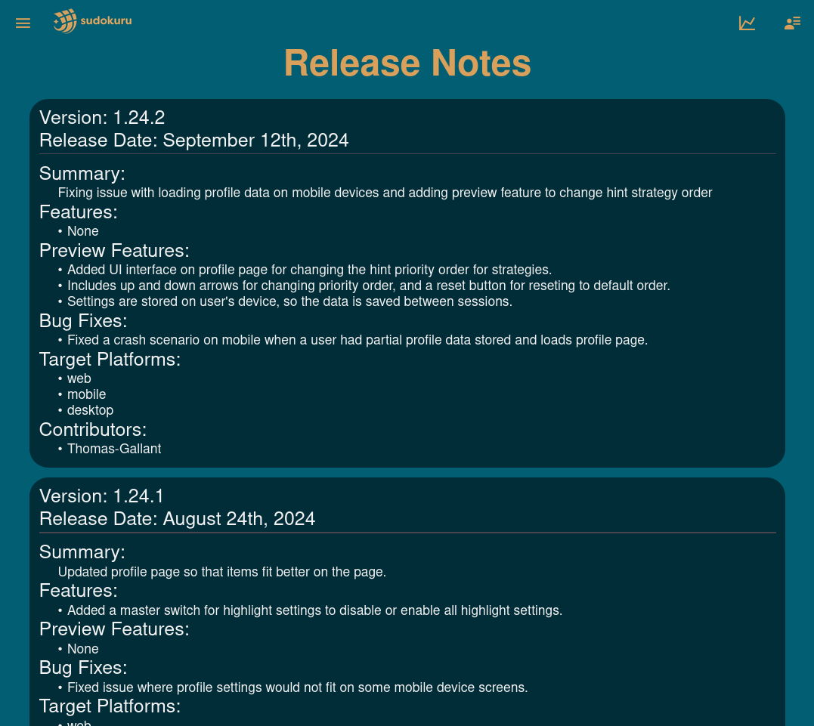
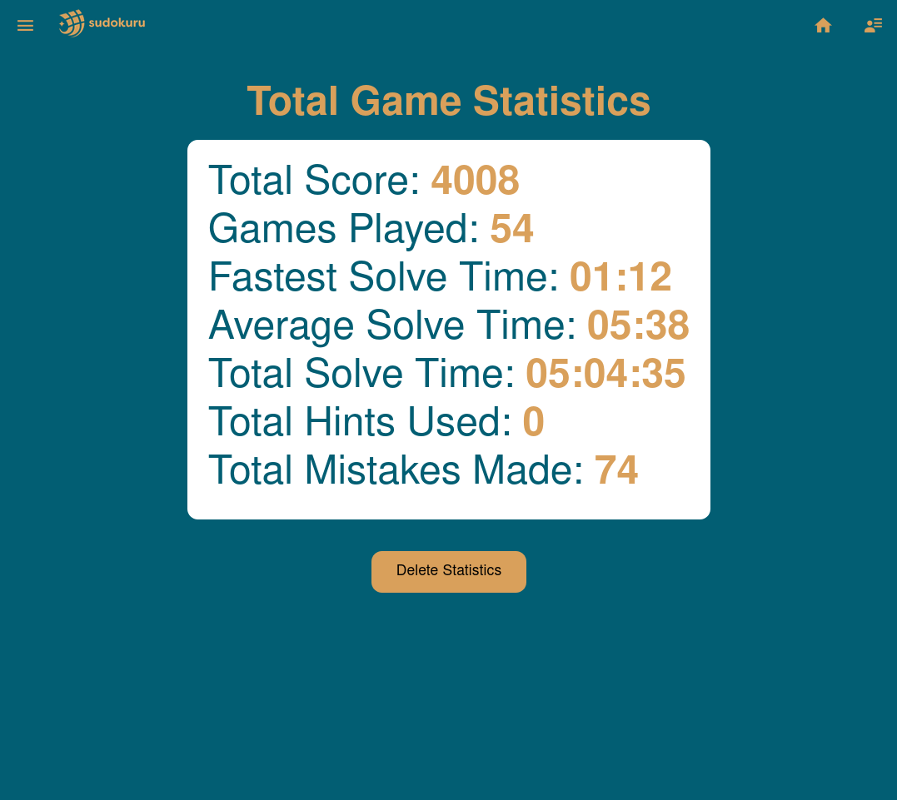
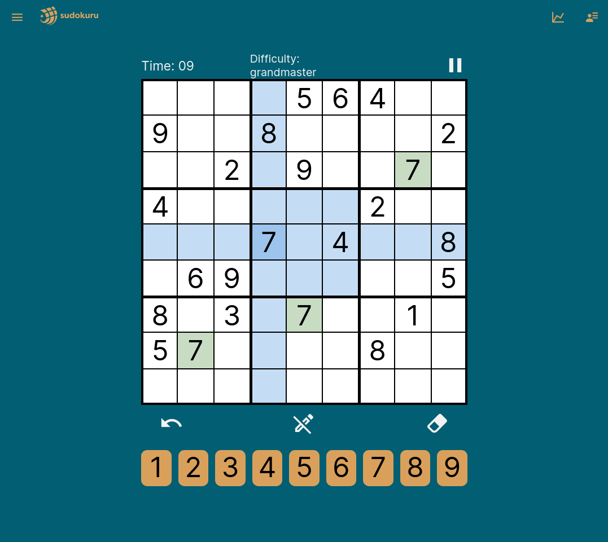

# The Official Cross-Platform Frontend for our Free Open Source Sudoku Project

# 💻 Try our DEV site at: https://sudokuru.pages.dev/

# ⬇️ Download our alpha 📱Android, 🐧Linux, and 🪟Windows app builds at: https://sudokuru.itch.io/sudokuru

[](https://github.com/SudoKuru/Frontend/actions/workflows/pipeline.yml)
[](https://coveralls.io/github/SudoKuru/Frontend?branch=main)
[](https://codecov.io/gh/SudoKuru/Frontend)
[](https://app.fossa.com/projects/git%2Bgithub.com%2FSudoKuru%2FFrontend?ref=badge_shield&issueType=license)
[](https://www.codefactor.io/repository/github/sudokuru/frontend)
[](https://app.codacy.com/gh/Sudokuru/Frontend/dashboard?utm_source=gh&utm_medium=referral&utm_content=&utm_campaign=Badge_grade)
[](https://codeclimate.com/github/Sudokuru/Frontend/maintainability)

<!--- Note: The following text is duplicated in the AboutUsPage.tsx file -->

## Sudokuru is an open-source project focused on developing a world-class, cross-platform Sudoku app. We aim to provide a delightful user experience while also contributing to the community by building a collection of reusable software modules. These modules are designed to be free, well-documented, modern, and interoperable, allowing developers to easily incorporate them into their own Sudoku-related projects.

### This frontend module is the primary user interface for Sudokuru, providing a cross-platform Sudoku experience built with React Native Web and TypeScript. It offers a clean, intuitive design with features such as:

- 🎮 Play Sudoku across 9 different difficulty levels generated by the Sudokuru Clearinghouse module
- 🎓 Learn how to play Sudoku with lessons from the basics all the way to advanced strategies
- 📊 Statistics to track your progress
- ⚙️ Sensible default settings for casual players with options to customize the playing experience for users with different playstyles
- 💡Custom strategy based hints from the Sudokuru npm library module
- 📅 _Upcoming_: drills which let you practice individual strategies also powered by the Sudokuru npm library module

# 🖥️ Supported Platforms

## Tier 1 Support

### 🚢 Web

## Tier 2 Support

### ⚒️ Android

### ⚒️ Windows

### ⚒️ Linux

## Planned Support

### 📅 iOS

### 📅 MacOS

## Legend

### 🚢 Tier 1 Support - We have full end to end test coverage for all new and existing functionality. We do manual testing of new features before deployment.

### ⚒️ Tier 2 Support - We have partial or zero end to end test coverage for new and existing functionality. We may not always do manual testing of new features before deployment.

### 📅 Planned Support - We do not currently support this platform, but we plan on supporting in the future.

# 🛠️ Local development

## ⚙️ General Setup:

1. Git clone this repository
2. Install Node.js `v19.5.0` or later
3. Install npm `9.3.1` or later
4. Run `npm i` in the root folder
5. [Install pre-commit hooks](https://pre-commit.com/#install)

6. Run `pre-commit install` to setup pre-commit hooks. Pre-commit hooks can be run manually with `npm run pre-commit`, but will always run before git commit and git push if setup correctly.

7. 
  ```shell
  npm run pre-commit
  ```

## 📲 Mobile Setup (not needed to run website):

1. Contact Thomas to get added to the Expo organization so that you can log in with your own email and password.
2. Download the expo app on your mobile device.
3. On your development device, e.g., laptop, login by running: `expo login` and fill out the parameters.

## 🏃‍♂️ Running the Application Locally

1. Run `npm run start` from this repositories root folder
2. For iOS, scan the QR code with your camera app, for Android you will need to scan the code from within the Expo app.
3. For Web, hit the w key to start up the website at `localhost:8081`

## 🧭 Navigating the Codebase

<details>
<summary>app</summary>

📂 sudokuru/app/ is the parent folder for all the application code

- 📡 Api/ contains classes to make it easier to interact with LocalStorage state data

- 🖼️ ️Components/ contains the React components displayed on the pages
  - Contains folders to store components for various pages
  - Due to its size and complexity we'll break down SudokuBoard directory further.
    - In addition to the SudokuBoard.tsx component, SudokuBoard contains a folder of subcomponents /Components, a folder of helper functions /Functions, and a sudoku.ts file with even more helper functions.
- ⚛️ Contexts/ contains the React contexts code
  - TODO: explain this folder better
- 🔢 Data/ contains files filled with Sudoku puzzles to serve to the user
- 🔨 Functions/ contains files of helper functions
- 🧭 Navigation/ contains code for Drawer navigation
- 📄 Pages/ contains the applications pages
  - AboutUsPage.tsx lets users learn more about the Sudokuru project
    - 
  - ContactPage.tsx lets users provide us with feedback from inside the app
    - 
  - DrillGame.tsx is not currently available to users
  - DrillPage.tsx is not currently available to users
  - HomePage.tsx is the users entry into the app
    - 
  - LearnPage.tsx lets users select lessons to start
    - 
  - Lesson.tsx lets users complete lessons
    - 
  - PlayPage.tsx lets users select puzzle to play based on difficulty
    - 
  - ProfilePage.tsx lets users select preferences e.g. theme
    - 
  - ReleaseNotesPage.tsx lets users see what's added to the app with each version update
    - 
  - StatisticsPage.tsx lets users see their Sudoku playing statistics
    - 
  - SudokuPage.tsx lets users play Sudoku!
    - 
- 🎨 Styling/ contains code for theme and highlighting colors

</details>

<details>
<summary>docs</summary>

📂 docs/ is the parent folder for all the documentation

- 📡 BackendApiCalls/ contains docs to help understand how to make API calls to Sudokuru npm library
- 🖼️ Components/ contains various docs related to Sudoku logic, terminology, and highlighting
- 📜 DesignDecisions/ contains docs explaining some historical design decisions made in the apps development
- 📸 PageScreenshots/ contains screenshots of the apps pages used as reference in this README

</details>

<details>
<summary>e2e/web</summary>

- 🖼️ components/ contains testing components to help assert things about components including the SudokuBoard itself
- 📄 page/ contains testing components to help assert things about pages
- 🎭 specs/ contains the actual Playwright e2e tests
- 🔢 data.ts contains test Sudoku game objects
- 🏗️ fixture.ts contains test fixtures including to automatically get things setup like navigating to a page to be tested

</details>

## 🎭 Playwright E2E Tests

### ⚙️ Setup

2. Run `npm run playwright:init` to install playwright dependencies
3. Inside of e2e/web folder, create a `.env` file in for local development based on values in `.env.example`

### 🏃‍♂️ Running the Tests

- ⚠️ Make sure that the website is running locally (or change baseURL to match where you want to test)
- 💻 Run `npm run playwright:ui` to run tests using playwright ui
- ⌨️ Run `npm run playwright:test` to run tests using playwright cli
- 📋 Run `npm run playwright:report` to view playwright report

### 🔧 Setup to use a Single Puzzle for Debugging

- In the `sudokuru/app/Api/Puzzles.ts` file, the `startGame` function can be modified so that only a single game is used.
- Replace `returnGameOfDifficulty(difficulty)` with `returnGameOfDifficulty("dev")` and the dev puzzle will be retrieved.
- The `returnGameOfDifficulty` function can also be modified to return a desired puzzle. By default, it returns the first `novice` puzzle.

## 🛡️🐶 Run Snyk scans

The command to run a Snyk Open Source scan is `npm run snyk:opensource`

The command to run a Snyk code scan is `npm run snyk:code`

Existing issues in the main branch can be [viewed here](https://app.snyk.io/org/sudokuru)

# 🛣️ Roadmap

## Github Project Kanban Boards

We organize our future work using the [Frontend Github Project Board](https://github.com/orgs/Sudokuru/projects/4/views/1) which we currently have divided into the following columns. We also apply labels which are [documented here](https://github.com/Sudokuru/Frontend/labels) and work towards milestones [listed here](https://github.com/Sudokuru/Frontend/milestones).

### 💡 Backlog

This is the general bucket for everything that we are considering doing someday but does not fit into any of the following boards.

### ⚙️ In development

This is for all the tickets we are currently working. Requires an acceptance criteria to be added to the description at this stage.

### 🚢 Shipped

This is for all the cool things we have already accomplished!
