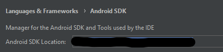

# Start the frontend app

Run `npm i` in the root folder  
Run `npm run start`

For testing with a mobile device you can download the Expo app.  
You will also need to be logged in to Expo on the development device (laptop/desktop that is running the code).  
To login type: `expo login` and fill out the parameters.

Contact Thomas to get added to the Expo organization so that you can log in with your own email and password.

For iOS, scan the QR code with your camera app, for Android you will need to scan the code from within the Expo app.

For Web, hit the w key to start up the website at `localhost:19000`

# EAS Update

[EAS Update Description](https://docs.expo.dev/eas-update/how-it-works/)

To make use of EAS update, run following commands:

1. `npm i -g eas-cli`

2. `npx expo install expo-updates`

3. `eas update --branch [branch] --message [message]` or `eas update --auto` (--auto will get message from latest commit and branch from current branch)

# Run Snyk scans

The command to run a Snyk Open Source scan is `npm run snyk:opensource`

The command to run a Snyk code scan is `npm run snyk:code`

Existing issues in main branch can be [viewed here](https://app.snyk.io/org/sudokuru)

# Run Playwright E2E Tests

## Setup

- run `npx playwright install` to install playwright dependencies
- create a `.env` file in for local development based on values in `.env.example`

## Run Tests

- make sure that the website is running locally (or change baseURL to match where you want to test)
- run `npm run playwright:ui` to run tests using playwright ui
- run `npm run playwright:test` to run tests using playwright cli
- run `npm run playwright:report` to view playwright report

# Run Code Coverage and Cypress E2E tests

Run `npm run web:dev`  
This starts the website in development mode, with access to the development plugins.  
Run `npm run open:cypress` or `npx cypress open` to open up the cypress testing interface.  
**Note: Running individual spec files will override the code coverage of the previous spec file**  
To generate a code-coverage report for all spec files, run the command `npx cypress run`. This will run all of the tests at the same time and output a combined code-coverage report at the end.  
To disable screenshots and video for cypress tests run `npm run test:cypress`  
After running tests, `.nyc_output` and `coverage` folders are generated. The coverage folder contains all of the code coverage results from the tests.  
More information can be found at [cypress docs](https://github.com/cypress-io/code-coverage).  
The best way to view coverage results locally is to open the `coverage/lcov-report/index.html` file.

# Build Android APK Locally

1. Follow the [guide here](https://docs.expo.dev/guides/local-app-development/#prerequisites)
2. SDK path for Android can be found by following below steps:  
   Android Studio > Tools > SDK Manager
     
   Use this value as `ANDROID_HOME` environment variable
3. Output directory for apk file is `android\app\build\outputs\apk\debug\app-debug.apk`

# Android testing with real android device

This project used [appium-boilerplate](https://github.com/webdriverio/appium-boilerplate/) as reference.

Turn on developer mode for android device.  
Enable USB tethering for android device.  
Run adb devices command to get `DEVICE_NAME`.  
`PLATFORM_VERSION` can be found from the device.

May be a way to do it over wifi as well:  
https://qaautomationworld.blogspot.com/2014/06/appium-executing-test-throgh-wi-fi-on-real-devies.html  
https://stackoverflow.com/questions/42992965/how-to-connect-to-your-device-from-terminal-using-adb-commands

---

Android Expo Method: Run `npm run android` command in the root directory to start the app locally if testing with expo.

Android Method: Build the apk file. Ensure that you have android sdk and java 17 setup from earlier.

1. Create a debug app with command `npx expo run:android`. More info can be [found here](https://docs.expo.dev/more/expo-cli/#compiling)
2. Create a final build of the android app. Can only be done on mac / linux. Command is `npx eas build --platform android --local`.

Update the SDK variable in `.env` to match path to sdk file.

If you used step 1 from earlier, you will also need to download the SDK for Sudokuru app on the phone/device, either from itch.io or from a pipeline build. Find some way to get the correct version on the device. The reason for this is that the sdk generated in step 1 is not good enough to run on its own, so it is only used for appium to identify which app to open on the device. Step 2 method shouldn't need to do this.

---

Run `appium:start` command in `e2e/mobile` directory. Before running the command ensure that `ANDROID_HOME` variable is set correctly.

Set the appropriate `.env` variables based on the `.env.config` file.

Run the [Appium Inspector](https://github.com/appium/appium-inspector/releases) and connect to the appium instance. The capabilitiy builder can be filled out by using values from the wdio config files.

The Appium Inspector is the easiest way to find UI selectors for writing test cases. The preferred selector types are as follows:

1. ID
2. Accessibility ID
3. Class Name
4. XPath

For elements that we have control over, we should be able to use Accessibility id. This would allow our test identifiers to be cross-platform between iOS and Android. XPath should be avoided when possible with appium due to stability issues, but sometimes it cannot be avoided.

More information can be found in these guides:

- https://www.browserstack.com/guide/locators-in-appium
- https://webdriver.io/docs/selectors/#mobile-selectors

Run the test cases using the desired profile.
Current working profiles:

- `wdio:android:expo`
- `npm run wdio:android:apk`

##

# Android Simulator (todo not ready yet)

appium with webdriver doesn't shut down port after execution:  
solution is to remove port:  
windows:  
`netstat -aon | findstr ":4723" | findstr "LISTENING"`  
`Taskkill /F /PID <pid>`

1. https://github.com/webdriverio/appium-boilerplate/blob/main/docs/FAQ.md#faq

Interesting info.

Appium Error:

- error: https://discuss.appium.io/t/error-wdio-appium-service-appium-exited-before-timeout/40704
- https://stackoverflow.com/questions/76173741/appium-exited-before-timeout-error-on-every-second-execution-in-wdio
- https://stackoverflow.com/questions/77966534/error-wdio-appium-service-appium-exited-before-timeout

Somewhat related:

- https://github.com/webdriverio/appium-boilerplate/issues/98

We are able to resolve this error by running Appium server seperatly and not using `@wdio/appium-service` package.

---

- https://webdriver.io/docs/devtools-service/#installation

- https://medium.com/tauk-blog/building-and-testing-native-mobile-apps-with-react-native-and-webdriverio-part-2-f1f595ebe6d0

- helpful guide to get appPackage and appActivity: https://www.automationtestinghub.com/apppackage-and-appactivity-name/

# Build iOS Simulator

This makes the claim that we can build the app without needing an apple developer account.  
https://docs.expo.dev/build-reference/simulators/

# Deployments

### Preview Branch

In order to deploy your local branch in preview mode, run the following command:  
`npm run preview:vercel`  
You will need to log in with our team email account.  
The console will output a preview url for viewing.

Preview mode can be run on any branch to preview how the site will look on Vercel.  
It is encouraged to use preview mode before merging changes into main.

### Preview PR

PR Previews can be viewed from the bot comment at the bottom of the PR.
PR Previews can also be viewed in the `Publish Preview` task of the `app_preview` job.  
The website link allows you to add comments directly to the webpage!
