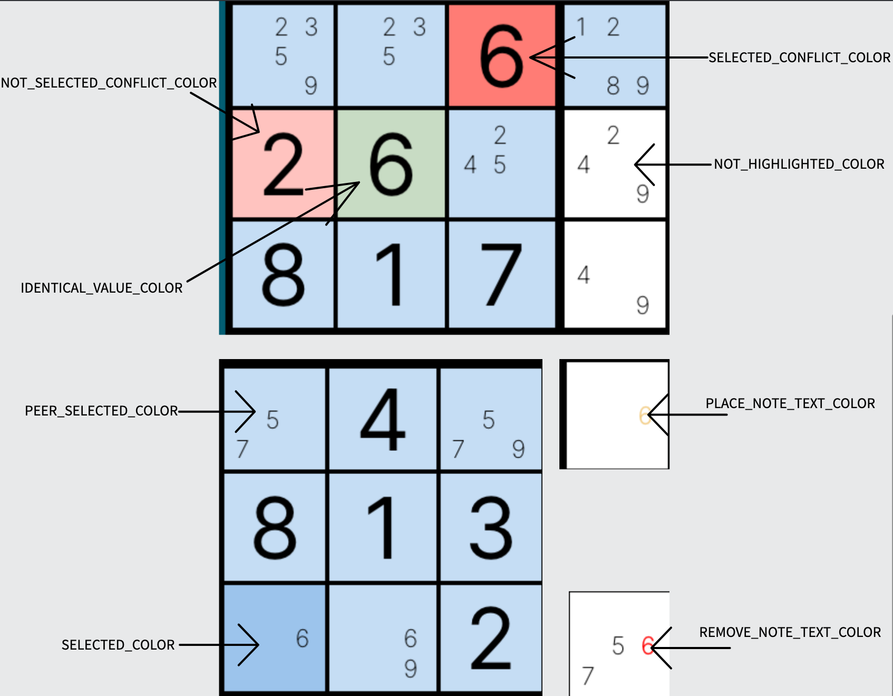

# Classic Variant

## Peer

A peer is any cell in the same box, row, or column of the selected cell. Sudopedia provides a [in-depth explanation](http://sudopedia.enjoysudoku.com/Peer.html).

## Identical Value

An identical value is any cell that shares the same value as a selected cell. The value must be 1-9.

## Selected Conflict

A selected conflict is when the selected cell contains an incorrect value.

## Not Selected Conflict

A not selected conflict is when a cell contains an incorrect value and is not selected.

## Diagram of board highlighting

