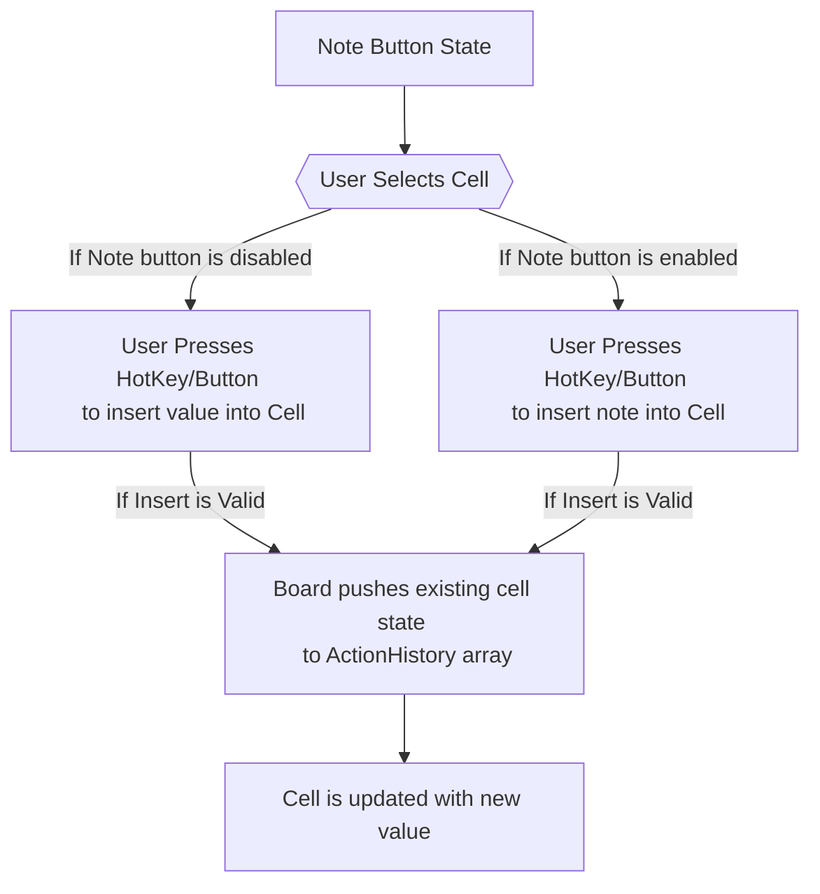
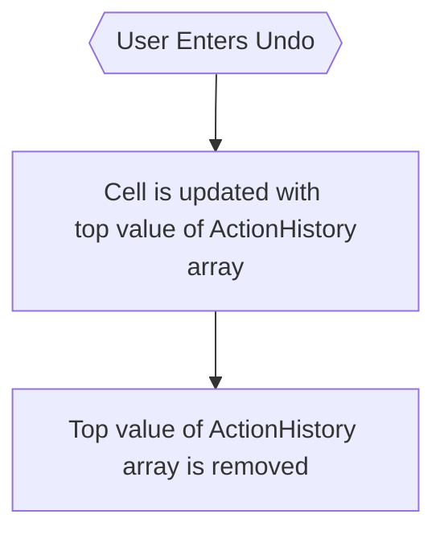

# Classic Variant

## Insertion Logic



## Undo Logic



<br>

For the purposes of cell insertion and undo logic, the Erase button is treated as an insertion of the value `0` and follows the same logic as any other value insertion.

Below is how the board represents an "Empty" cell:

```json
{ "type": "value", "entry": 0 }
```

## When is the game saved to localstorage

- After an insertion into a cell
- Before pausing the game
