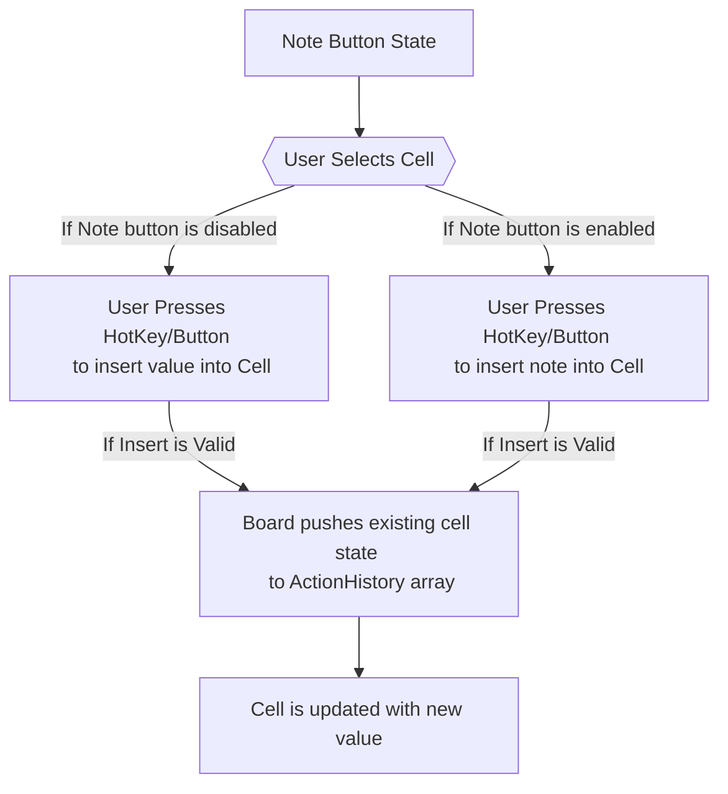
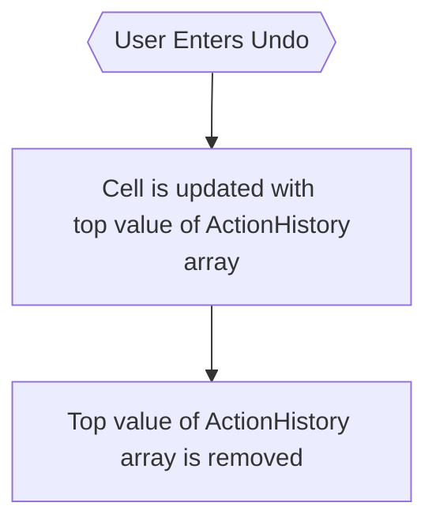

# Classic Variant

## Insertion Logic



## Undo Logic



<br>

For the purposes of cell insertion and undo logic, the Erase button is treated as an insertion of the value `0` and follows the same logic as any other value insertion.

Below is how the board represents an "Empty" cell:

```json
{ "type": "value", "entry": 0 }
```

## When is the game saved to localstorage

- After an insertion into a cell
- Before pausing the game

## How the game score is calculated

The game score is broken up into 3 different subscores.
Subscores will always be greater than or equal to 0, which means a negative score is not possible. These subscores are added together to get a score between 0-100.

The subscores are divided as follows:

### Time Score

This is based on the total time taken to complete the puzzle.

Users can get a maximum of 30 points. Users get 0 points if their game takes 30 minutes. Users get 30 points if their game takes less than 1 minute, with every minute docking 1 point from the subscore.

### Difficulty Score

This is based on the difficulty of the puzzle.

Users can get a maximum of 30 points. Users get 10 points for an easy puzzle, 20 points for a medium puzzle, and 30 points for a hard puzzle.

### Incorrect cells and hints score

This is based on the number of incorrect cells and hints during the game.

Users can get a maximum of 40 points, with every hint asked for or incorrect cell placed decreasing the score by 1.
